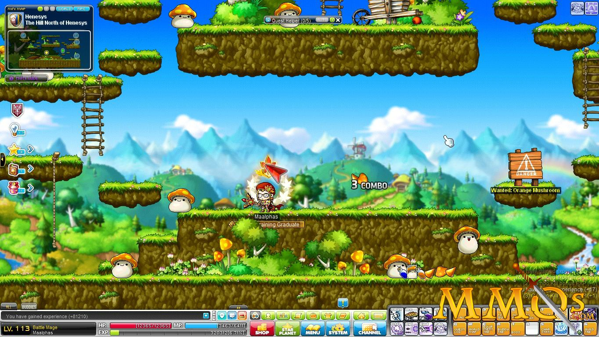
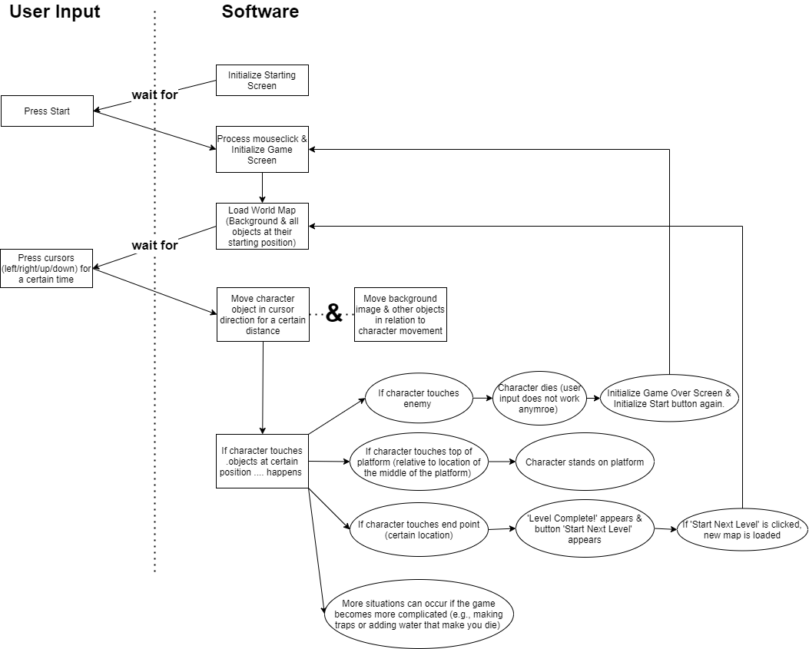

# Platformer

## Overview
Platformer is a simple platform game in which you jump on platforms 
and might have to dodge some moving objects or defeat enemies.
I'm hoping to make this look a bit like Maplestory, to honour my childhood. 
Unlike Maplestory, this is a single player game, not multiplayer, so it won't be played online.

## Scenarios
My brother is bored at home during these corona times as he has 
just finished the game ORI and the blind forest. He wants to 
start a new game, and thus I promised him I would make one. 
In this game he wants to jump around a small map until he
reaches the end of the map. As it's a single player game, 
one only has to download the package. Once downloaded, you 
just press start to start the game.

## Flowchart
To make the game run smoothly various elements need to be 
programmed. Objects like the main character, enemies and 
platforms need to be created. A world or background must be 
made. These all need a certain position in some space. Secondly,
interactions of the user need to be added. For instance,
if a user presses left on the keyboard, the character
object needs to move a certain amount to the left direction.

